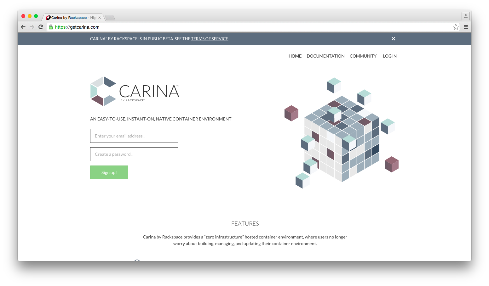
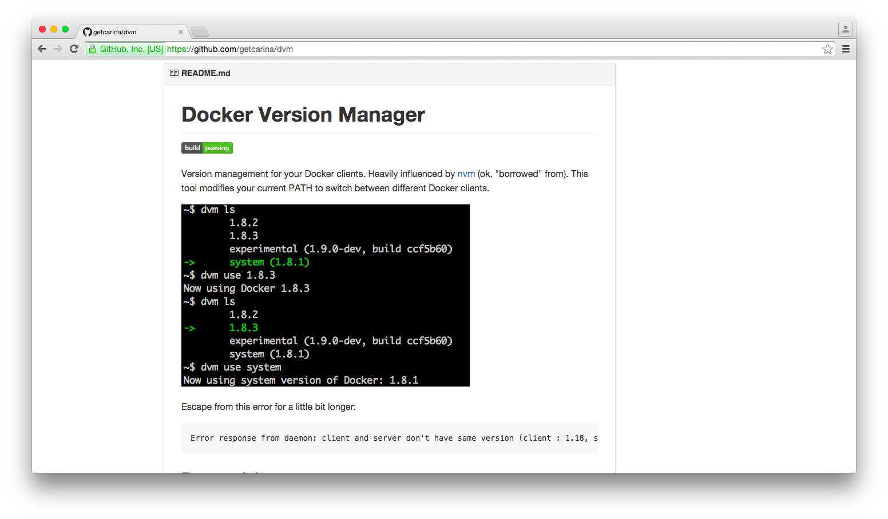
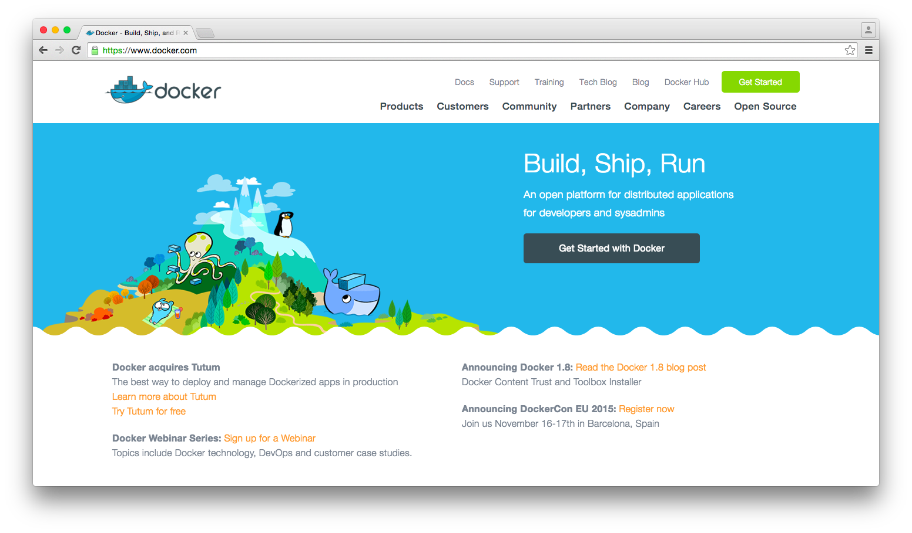
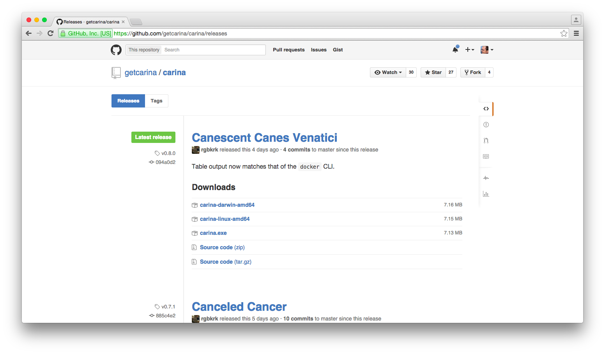
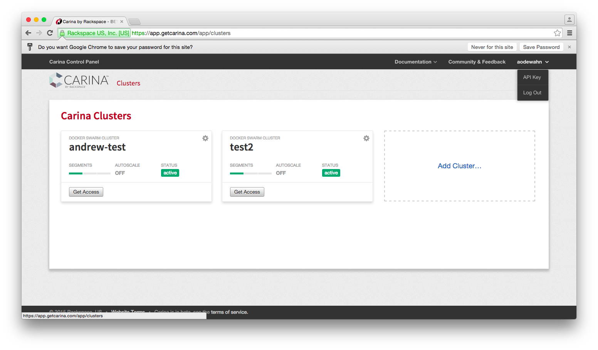
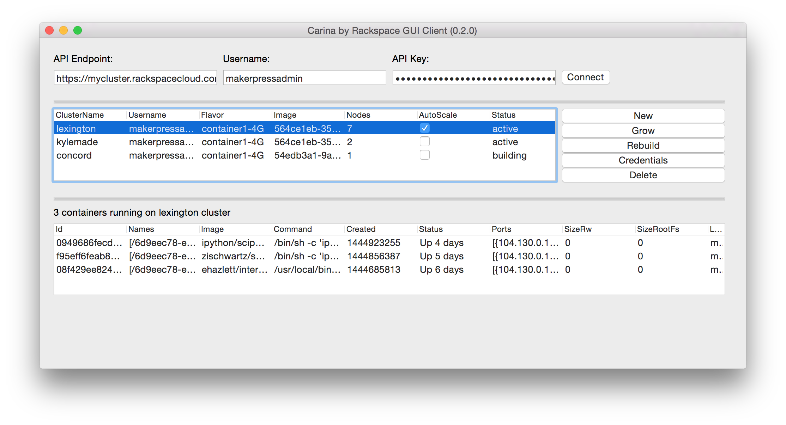

# Getting started with Carina by Rackspace

Andrew Odewahn (@odewahn)

Docker Hack Day

Nov. 3, 2015


## Carina by Rackspace

* "Docker Swarm" as a service
* Create up to 3 clusters with 3 nodes
* Beta is free for first year
* Use native Docker tooling


## Carina is a *simple* way to use Docker without having to manage infrastructure


## Overview

* Create an account
* Install `docker` client
* Install `carina` client
* Create a cluster
* Run Docker


## Create a carina account

https://getcarina.com/




## Install dvm

https://github.com/getcarina/dvm

```
curl -s https://raw.githubusercontent.com/getcarina/dvm/master/install.sh | sh
```




## Install Docker 1.8.2 client

```
$ dvm install 1.8.2
Installing 1.8.2...
Now using Docker 1.8.2
$ dvm use 1.8.2
Now using Docker 1.8.2
```




## Download carina CLI

https://github.com/getcarina/carina/releases




## Make `carina` executable

```
$ mv ~/Downloads/carina-darwin-amd64 /usr/local/bin/carina
$ chmod +x /usr/local/bin/carina
```


## Set environment variables

Set these values in `.bashrc` or `.bash_profile`

```
CARINA_API_ENDPOINT=https://app.getcarina.com
CARINA_APIKEY=<your key>
CARINA_USERNAME=<your username>
```




## Create a cluster

```
$ carina create test2
test2               container1-4G       1                   false               new

$ carina list
ClusterName         Flavor              Nodes               AutoScale           Status
andrew-test         container1-4G       1                   false               active
test2               container1-4G       1                   false               active

```


## Download credentials for the cluster

```
$ carina credentials test2
#
# Credentials written to "/Users/odewahn/.carina/clusters/aodewahn/test2"
#
source "/Users/odewahn/.carina/clusters/aodewahn/test2/docker.env"
# Run the command above to get your Docker environment variables set
```


## Set docker credentials

```
source "/Users/odewahn/.carina/clusters/aodewahn/test2/docker.env"
```


## Use Docker

```
$ docker info
Containers: 3
Images: 2
Role: primary
Strategy: spread
Filters: affinity, health, constraint, port, dependency
Nodes: 1
 2bb2f2d8-dfdb-476f-b668-410c82f95195-n1: 172.99.79.41:42376
  └ Containers: 3
  └ Reserved CPUs: 0 / 12
  └ Reserved Memory: 0 B / 4.2 GiB
  └ Labels: executiondriver=native-0.2, kernelversion=3.18.21-1-rackos, operatingsystem=Debian GNU/Linux 7 (wheezy) (containerized), storagedriver=aufs
CPUs: 12
Total Memory: 4.2 GiB
Name: e35d3516254c
```


## My project: carina-gui

https://github.com/odewahn/carina-gui


